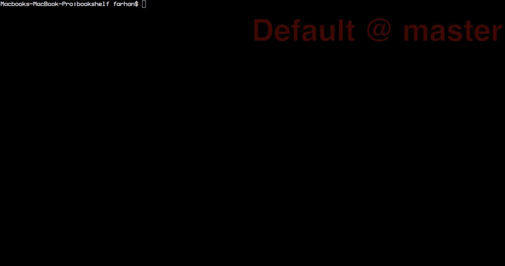

#Bookshelf
A command line ruby app, to query books by title.


###Setup
- `cd` into the project directory
- And run `source setup` 

###Usage
Syntax:

```
bookshelf [bookname]
```
Example:

```
$> bookshelf "A mirror to the blind"
```
